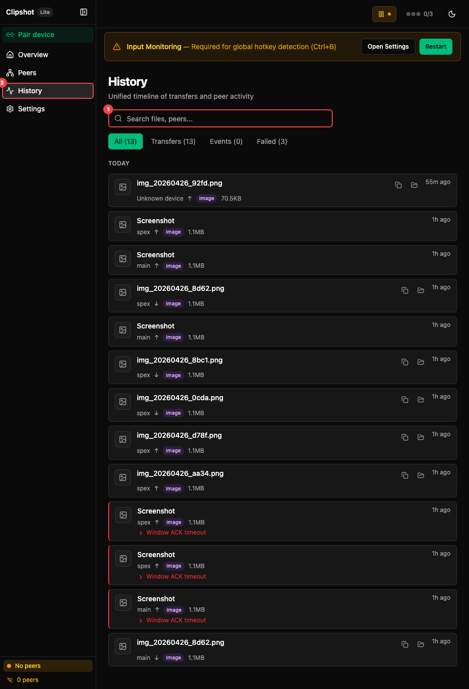

History is a unified timeline of transfers and peer activity.

The annotated view highlights: ① **Search files, peers...** field — search by filename, peer name, or content type. ② Filter chips: **All**, **Transfers**, **Events**, **Failed** with counts. ③ **Pair device** button in the sidebar — the main entry point for adding new devices.

### Search

The search box lets you search by:
- filename
- peer name
- content type

### Filters: All / Transfers / Events / Failed

Use the filter row to switch between:
- **All** — everything
- **Transfers** — sent and received items
- **Events** — connect and disconnect events
- **Failed** — only failed transfers

Each filter shows its current count.

### Timeline

The timeline is grouped by date with sticky date headers, so the current day label stays visible as you scroll.

If there is no history yet, the page explains that transfers and events will appear automatically.

### Transfer Row

Every transfer row can show:
- image thumbnail preview, when available
- file or content icon for non-images
- file name or content name
- text preview for text clipboard entries
- peer name
- sent/received arrow
- content badge such as **Image**, **Text**, or **File**
- size
- time of day

Actions:
- **Copy path**
- **Open folder**
- **Retry transfer** for failed items

Failed transfers:
- show a red left border
- show a short error summary
- can expand to reveal the full error, peer details, and address

In-progress transfers:
- show a blue left border
- show a progress bar
- show transferred size, total size, and percent
- can also show chunk progress, speed, and ETA

### Event Row

Event rows show peer connection changes.

Each row includes:
- connected or disconnected icon
- text like `Laptop connected` or `Server disconnected`
- optional secondary peer details
- time of day
