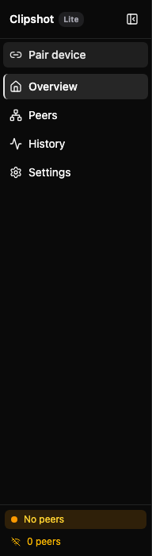
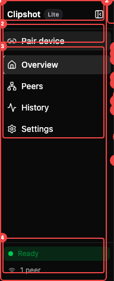
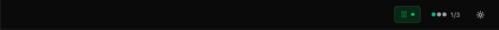
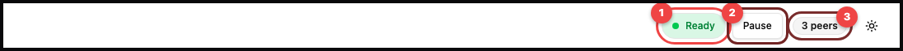
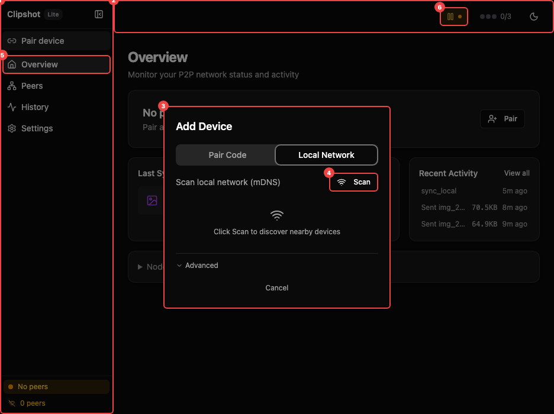

After pairing, the main window has:
- a left sidebar with **Overview**, **Peers**, **History**, **Settings**
- a **Pair device** button in the sidebar
- a **Lite** or **Pro** badge near the app name
- a top bar with sync status, peer count, and theme toggle

The sidebar can be collapsed and expanded.

### Sidebar

The sidebar callouts show: ① App name and plan badge (**Pro** or **Lite**). ② Collapse/expand sidebar button. ③ Navigation links: **Overview**, **Peers**, **History**, **Settings**. The active page is highlighted with a background fill.

Below the app name, the **Pair device** button opens the Add Device dialog from any page. At the bottom, the sidebar footer shows the current sync state label and peer count.

### Header Bar

The header bar shows: ① Sync toggle button — an icon-only button that pauses or resumes sync. Its background color reflects the current sync state (green for ready, blue for sending, amber for no peers, grey for paused). ② Peer count badge — colored dots and a connected/total count such as `2/3`. ③ Theme toggle — switches between light and dark mode.

Note: the text sync status label (**Ready**, **Sending**, **Receiving**, **No peers**, or **Paused**) appears in the sidebar footer, not in the header bar.

The annotated view highlights: ② Sidebar — navigation and status area. ③ Status hero card — your network health at a glance. Below the hero are three cards: Last Synced, Devices, and Recent Activity. At the bottom is a collapsible Node details section.

> Note: some callouts may be hard to see on the dark theme. The five main sections are the hero card, last synced, devices, recent activity, and node details.

### Status hero

The large top card summarizes the current state.

What you see:
- headline:
  - **All systems ready** when at least one device is connected
  - **No peers connected** when nothing is online
- summary line with:
  - connected device count
  - last sync time, if available
- action buttons:
  - **Pair**
  - **View Peers** when at least one device is connected

Extra alerts inside the card:
- **Sync is paused** banner with a **Resume** button
- a device-limit warning if your current plan does not allow more devices

### Last synced card

This card shows your most recent successful transfer.

It includes:
- an icon for image, text, or file
- the file or content name
- whether it was **Sent to** or **From** a device
- size, when known
- relative time such as `just now` or `5m ago`

If nothing has synced yet, it says: **Copy something to start syncing**.

Clicking the card opens **History**.

### Devices card

This card shows currently connected devices as compact badges.

Each badge can show:
- green online dot
- device name
- latency in milliseconds, when available

If there are more than six connected devices, the card shows `+N more`.

If none are connected, it says **No devices connected**.

Clicking the card opens **Peers**.

### Activity card

This card shows the latest activity entries.

What it includes:
- up to 3 recent items
- failures first, so problems are easier to notice
- transfer lines such as:
  - `Sent photo.png to Work Mac`
  - `Received notes.txt from Server`
- peer events such as:
  - `Laptop connected`
  - `Desktop disconnected`
- file size when known
- time of day
- **View all** link to open **History**

### Node details

At the bottom of the page there is a collapsible **Node details** section.

It shows:
- node name
- uptime
- listening port
- node ID
- copy button for the node ID
