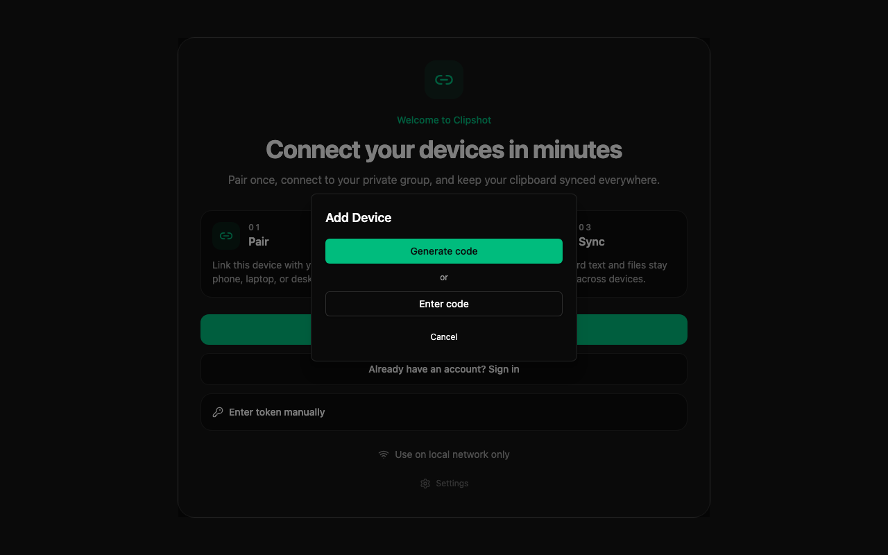

The Peers page is where you add, view, pin, reconnect, disconnect, and remove devices.

The annotated view highlights: ① **Search devices...** field — search by name or node ID. ② Filter buttons with counts: **All**, **Connected**, **Offline**, **Pinned**. ③ A device card showing name, status, transport, latency, and actions. ④ **Add Device** button — opens the pairing dialog.

If you have no devices yet, the page shows an empty state card with:
- **Add Device**
- **Scan LAN**
- current **Hub** status: Connected or Disconnected
- tip text recommending a pair code

### Search & Filters

At the top of the page you get:
- a **Search devices...** field
- filter buttons with counts:
  - **All**
  - **Connected**
  - **Offline**
  - **Pinned**

Search matches:
- device name
- node ID prefix

Peer cards are grouped into sections:
- **Pinned**
- **Connected**
- **Disconnected**

### Device Card

Each card represents one device.

Visible fields and indicators:
- pin star in the top-left corner
- device name
- **Connected** or **Offline** badge
- for offline devices, optional **Last seen ...** text
- optional offline reason such as:
  - **Remote device limit reached**
  - **Free tier limit reached**
- device type:
  - Laptop
  - Desktop
  - Server
  - WSL
- transport label:
  - **Direct**
  - **Relay**
- latency, or **Latency: pending** while measuring
- activity line such as:
  - **Connected, no sync yet**
  - **Last sync: 3m ago**
  - **Added to network**
- for limited devices, a note:
  - **Free tier limit reached. Activate to swap this device in.**

If the device is transferring something right now, the card also shows:
- a small progress bar
- text like **Sending 2.1MB / 10.0MB** or **Receiving ...**

If Clipshot knows multiple addresses for the same device, the card can expand to show an address list.

Buttons and actions:
- **Details** for connected devices
- **Reconnect** for normal offline devices
- **Activate** for devices blocked by the Lite plan limit
- overflow menu with:
  - **Details** for offline devices
  - **Disconnect** for connected devices
  - **Remove** for all devices

Important:
- **Disconnect** and **Remove** use a two-step confirmation in the menu: first click changes the item to **Confirm?** for a few seconds.
- Pinning a device moves it into the **Pinned** section and makes it easy to find later.

### Adding a New Device

Use either:
- **+ Add Device** button on the Peers page
- the sidebar **Pair device** button

Both open the same Pair dialog.

#### Pair dialog

The dialog has two buttons:

- **Generate code** — creates a 6-digit numeric code valid for **5 minutes**. The code is displayed as `NNN NNN` (e.g. `154 603`). While waiting, the dialog shows "Waiting for other device...".
- **Enter code** — type the 6-digit code from another device and click **Join**.

After both devices exchange codes they perform a Diffie-Hellman key exchange and each show **4 confirmation digits**. Compare the digits out-of-band (say them aloud, type them in chat, etc.):

- Digits match → click **Yes, they match** on both devices. Devices are now connected. ✓
- Digits differ → click **No** and start over. Mismatched digits indicate the connection may have been intercepted.

The pair flow works across the internet (via Portal) and on local networks (via mDNS), automatically choosing the fastest available transport. No account required.

Use the pair code flow when:
- adding your own laptop or companion machine
- installing Clipshot on a remote server
- you want the simplest and most secure flow

### Device Details

Opening **Details** shows a dialog with peer information.

View mode shows:
- device name
- **Connected** or **Offline** badge
- device type, when known
- transport:
  - **Direct • QUIC**
  - **TCP**
  - or `—`
- latency
- node ID with copy button
- last sync time
- collapsible **Addresses** section

Click **Edit** to change:
- device name
- saved addresses
- auth code

Then click **Save** or **Cancel**.

### Removing a Device

To remove a device:
1. Open the device card menu.
2. Click **Remove**.
3. Click **Confirm?** before the confirmation times out.

To temporarily stop a connected device without deleting it:
1. Open the menu.
2. Click **Disconnect**.
3. Click **Confirm?**.
