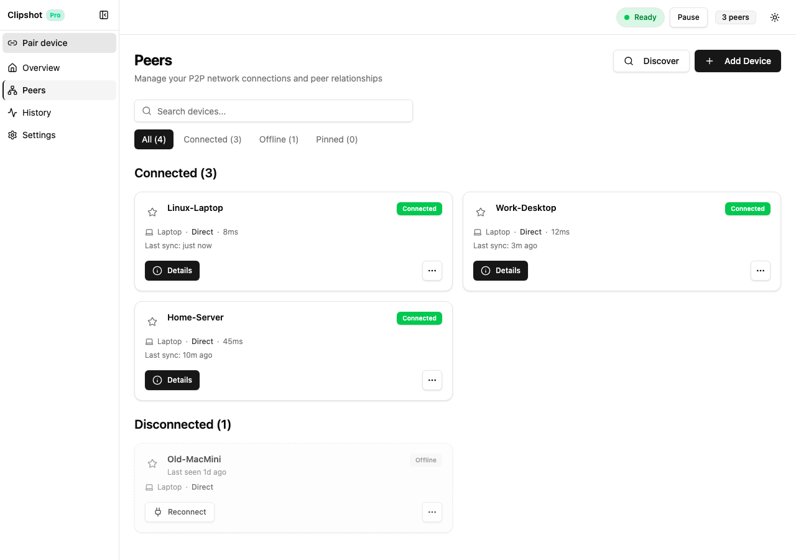
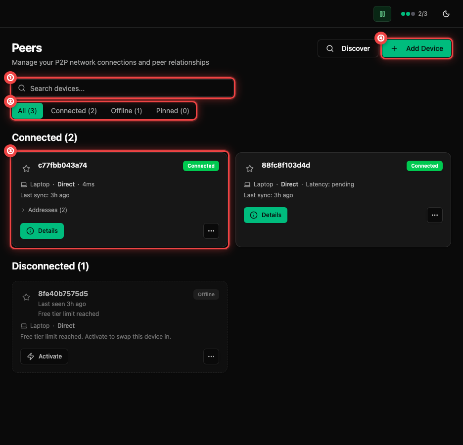
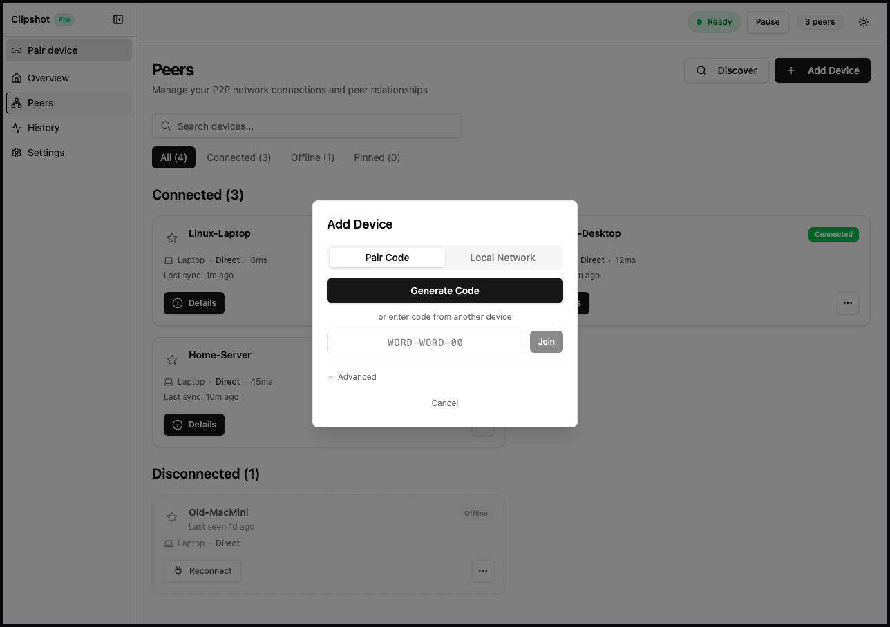
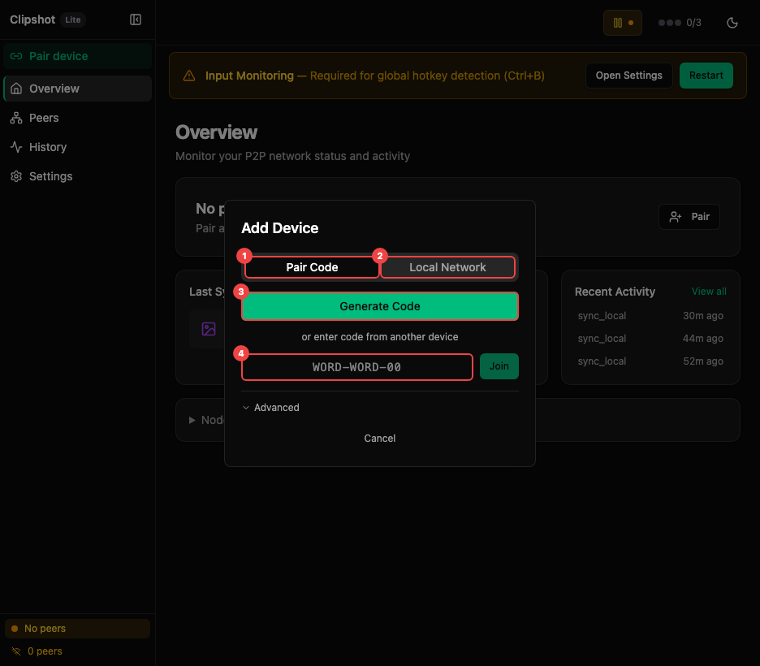
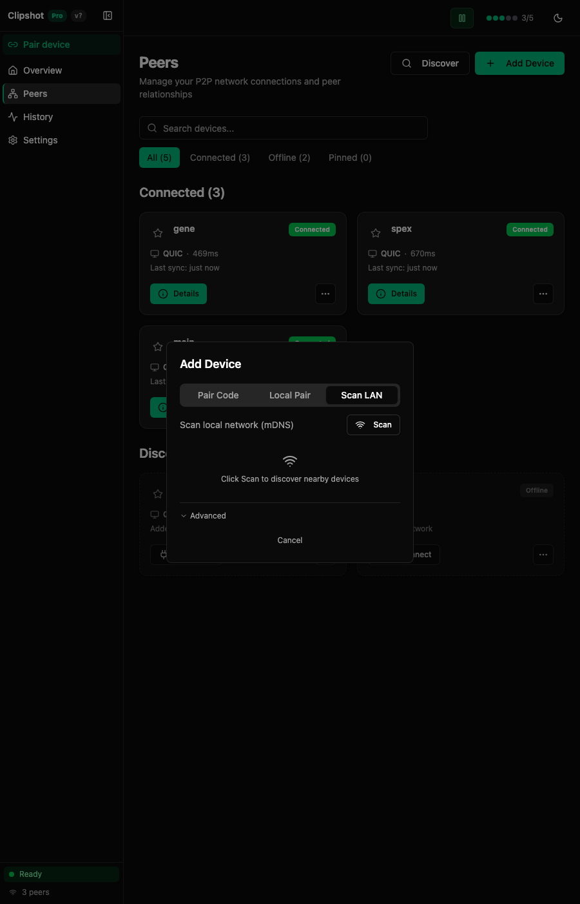

The Peers page is where you add, view, pin, reconnect, disconnect, and remove devices.

The annotated view highlights: ① **Search devices...** field — search by name or node ID. ② Filter buttons with counts: **All**, **Connected**, **Offline**, **Pinned**. ④ **Add Device** button — opens the pairing dialog. Device cards (not annotated in this screenshot) show name, status, transport, latency, and actions.

If you have no devices yet, the page shows an empty state card with:
- **Add Device**
- **Scan LAN**
- current **Hub** status: Connected or Disconnected
- tip text recommending a pair code

### Search & Filters

At the top of the page you get:
- a **Search devices...** field
- filter buttons with counts:
  - **All**
  - **Connected**
  - **Offline**
  - **Pinned**

Search matches:
- device name
- node ID prefix

Peer cards are grouped into sections:
- **Pinned**
- **Connected**
- **Disconnected**

### Device Card

Each card represents one device.

Visible fields and indicators:
- pin star in the top-left corner
- device name
- **Connected** or **Offline** badge
- for offline devices, optional **Last seen ...** text
- optional offline reason such as:
  - **Remote device limit reached**
  - **Free tier limit reached**
- device type:
  - Laptop
  - Desktop
  - Server
  - WSL
- transport label:
  - **Direct**
  - **Relay**
- latency, or **Latency: pending** while measuring
- activity line such as:
  - **Connected, no sync yet**
  - **Last sync: 3m ago**
  - **Added to network**
- for limited devices, a note:
  - **Free tier limit reached. Activate to swap this device in.**

If the device is transferring something right now, the card also shows:
- a small progress bar
- text like **Sending 2.1MB / 10.0MB** or **Receiving ...**

If Clipshot knows multiple addresses for the same device, the card can expand to show an address list.

Buttons and actions:
- **Details** for connected devices
- **Reconnect** for normal offline devices
- **Activate** for devices blocked by the Lite plan limit
- overflow menu with:
  - **Details** for offline devices
  - **Disconnect** for connected devices
  - **Remove** for all devices

Important:
- **Disconnect** and **Remove** use a two-step confirmation in the menu: first click changes the item to **Confirm?** for a few seconds.
- Pinning a device moves it into the **Pinned** section and makes it easy to find later.

### Adding a New Device

Use either:
- **Add Device**
- **Discover**
- the sidebar **Pair device** button

All of them open the same add-device dialog.

#### Pair Code

This is the recommended method.

The callouts show: ① **Generate Code** — creates a short code valid for 5 minutes. ② Code input field — enter a code from another device, then click **Join**. ③ **Advanced** — expand for Paste Link and Manual Entry options.

Inside the dialog:
- existing devices can click **Generate Code**
- any device can enter a code and click **Join**
- generated codes show:
  - the code itself
  - **Valid for 5 minutes**
  - a copyable CLI command

Use Pair Code when:
- adding your own laptop or phone-sized desktop companion
- installing Clipshot on a remote machine
- you want the simplest flow

#### Local Network Scan

The **Local Network** tab scans your LAN with mDNS.

What you can do:
- click **Scan**
- see a list of found devices
- select one or more checkboxes
- click **Add Selected**

Best for:
- devices on the same home or office network
- quick setup without sharing links

Limits:
- LAN only
- does not help across the internet

#### Paste Link

In **Advanced → Paste Link**, you can paste:
- `clipshot://...`
- `iroh://...`

Then click **Connect**.

Use this when:
- someone sent you a Clipshot share link
- you want an advanced/manual pairing method

#### Manual Entry

In **Advanced → Manual Entry**, you can enter:
- **Name**
- **Address**
- optional **Password**

The address can be:
- an `iroh://...` address
- an IP address or hostname

Use this when:
- you already know the remote address
- you are connecting to a protected node that requires a password

### Device Details

Opening **Details** shows a dialog with peer information.

View mode shows:
- device name
- **Connected** or **Offline** badge
- device type, when known
- transport:
  - **Direct • QUIC**
  - **TCP**
  - or `—`
- latency
- node ID with copy button
- last sync time
- collapsible **Addresses** section

Click **Edit** to change:
- device name
- saved addresses
- auth code

Then click **Save** or **Cancel**.

### Removing a Device

To remove a device:
1. Open the device card menu.
2. Click **Remove**.
3. Click **Confirm?** before the confirmation times out.

To temporarily stop a connected device without deleting it:
1. Open the menu.
2. Click **Disconnect**.
3. Click **Confirm?**.
