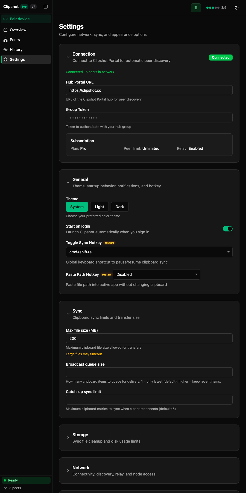
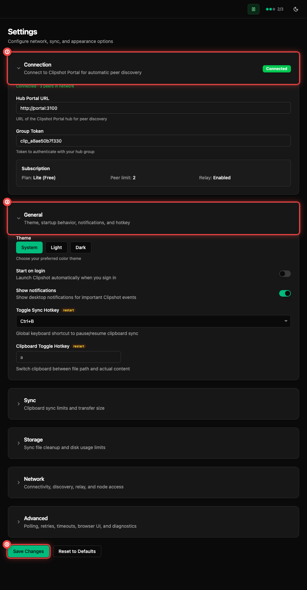

The Settings page is split into collapsible cards. Clipshot remembers which sections you keep open or closed.

The annotated view highlights: ① **Connection** card with Hub Portal URL, Group Token, and subscription info. ② **General** card with theme, startup, and hotkey settings. At the bottom, **Save Changes** and **Reset to Defaults** buttons.

If you make changes, a sticky bar appears at the bottom with:
- **Discard**
- **Save**

At the bottom of the page you also get:
- **Save Changes**
- **Reset to Defaults**

### Connection (hub_url, group_token)

The **Connection** card controls how your device joins Clipshot Portal.

Visible items:
- status badge:
  - **Not configured**
  - **Connected**
  - **Disconnected**
- **Hub Portal URL**
- **Group Token**
- subscription summary showing:
  - plan: Lite or Pro
  - peer limit
  - relay enabled or disabled

You may also see:
- `Connected · N peers in network`
- `Connecting to portal...`
- device-limit warning with **Open Portal Devices** button

About `relay_url`:
- Relay URL affects connectivity too, but in the current UI it is edited in the **Network** card, not inside **Connection**.

### General (theme, hotkey)

The **General** card includes:
- **Theme**:
  - System
  - Light
  - Dark
- **Start on login** switch
- **Toggle Sync Hotkey** selector
- **Paste Path Hotkey** selector

Notes:
- the default sync toggle hotkey is **Cmd+Shift+S** (macOS) or **Ctrl+Shift+S** (Windows/Linux)
- the default paste path hotkey is **Cmd+B** (macOS) or **Ctrl+B** (Windows/Linux)
- changing hotkeys requires a restart

### Sync (catchup_limit, max_file_size, broadcast_queue_size)

The **Sync** card includes:
- **Max file size (MB)**
- **Broadcast queue size**
- **Catch-up sync limit**

What they mean:
- **Max file size** limits what Clipshot will send
- **Broadcast queue size** controls how many clipboard items are queued for delivery (1–10, default 1). At 1, a new copy overwrites the previous pending item. Higher values keep recent items in the queue.
- **Catch-up sync limit** controls how many recent clipboard entries a reconnecting device can fetch

If you set a very large file limit, Clipshot warns that large files may time out.

### Storage (sync file retention)

The **Storage** card includes:
- **Max files** — maximum number of files to keep in the sync directory (0 = unlimited)
- **Max age (days)** — delete synced files older than this many days (0 = unlimited)
- **Max size (MB)** — maximum total size of the sync directory (0 = unlimited)

These settings control automatic cleanup of `~/.clipshot/sync/`.

### Network (listen_port, max_peers)

The **Network** card includes:
- **Listen Port**
- **Max Peers**
- **Auto Discover** switch
- **Relay URL**
- **Node Password**

What they do:
- **Listen Port** is the port this device listens on for P2P traffic
- **Max Peers** caps simultaneous peer connections
- **Auto Discover** enables local network discovery
- **Relay URL** is used for NAT traversal and long-distance fallback
- **Node Password** protects your node so only devices with that password can connect

Invalid listen ports are highlighted immediately.

### Advanced (timeouts, retries)

The **Advanced** card includes:
- **Poll Interval (ms)**
- **Retry Attempts**
- **Timeout (ms)**
- **Use Browser UI** switch

It also has a **Transfer timeouts** subsection with:
- **Base Transfer Timeout (ms)**
- **Timeout per MB (ms)**
- **Chunk Timeout (seconds)**
- **Direct Send Threshold (MB)**

These settings are mainly for slow links, large files, and difficult network conditions.

### Export / Import

At the bottom of the Advanced card you can:
- **Export Settings** to a JSON file
- **Import Settings** from a JSON file

Import does not apply changes immediately. After import, click **Save**.

### Diagnostics

The diagnostics area shows live runtime information with copy buttons.

Current fields:
- node name
- node ID
- uptime
- iroh address
- hub status

Use this section when:
- support asks for your node ID
- you want to verify the app is connected to the hub
- you need your device address for manual pairing
