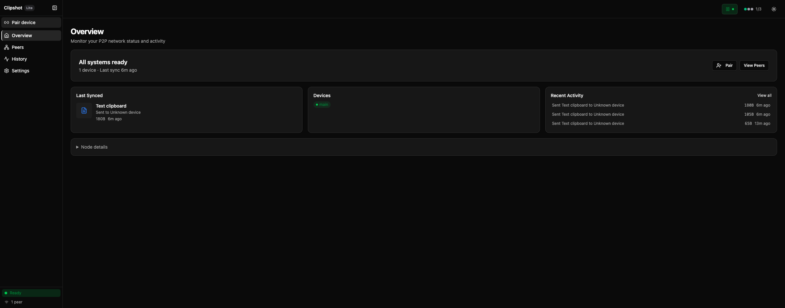

# Clipshot

**P2P clipboard sync across all your devices.** Copy on one — paste on another. Encrypted, no cloud, no accounts.

[Download](https://clipshot.cc/#download){: .btn .btn-primary }
[Installation](installation){: .btn }
[User Guide](gui/){: .btn }

---

## Install

```bash
# With account:
curl -fsSL https://clipshot.cc/install.sh | bash -s -- --code=BLUE-FISH-42

# Without account (local pair):
curl -fsSL https://clipshot.cc/install.sh | bash -s -- --code=LOCAL_MOON_42 --addr=192.168.1.10:18080
```

Or open the GUI → **Pair device** → **Local Pair** → enter code.

---

## Features

- **Instant sync** — text, images, files between your devices
- **P2P encrypted** — data goes directly between devices (QUIC/TLS), never through a server
- **No account needed** — works on local network with `LOCAL_WORD_NN` pair codes
- **Mesh forwarding** — data reaches all devices through connected peers, even across network boundaries
- **Cross-platform** — macOS, Linux, Windows, headless servers, WSL
- **Pair codes** — local (`LOCAL_MOON_42`) or portal (`BLUE-FISH-42`)
- **Catch-up** — missed syncs delivered on reconnect via outbox
- **GUI + CLI** — desktop app with tray icon, or headless daemon

---

## Pages

| | |
|:--|:--|
| [Installation](installation) | Install, pair, first launch |
| [Overview](gui/overview) | Dashboard, devices, activity |
| [Peers](gui/peers) | Add, remove, manage devices |
| [History](gui/history) | Sync timeline, transfers |
| [Settings](gui/settings) | Configuration options |
| [How sync works](features/sync) | Clipboard → peers → file |
| [Discovery](features/discovery) | How devices find each other |
| [Hotkeys](features/hotkeys) | Keyboard shortcuts, tray menu |
| [CLI](cli) | Headless daemon, commands |
| [Pricing](pricing) | Lite vs Pro |
| [API](api) | HTTP API reference |
| [FAQ](faq) | Common questions |
| [Troubleshooting](troubleshooting) | Fix common issues |

---


