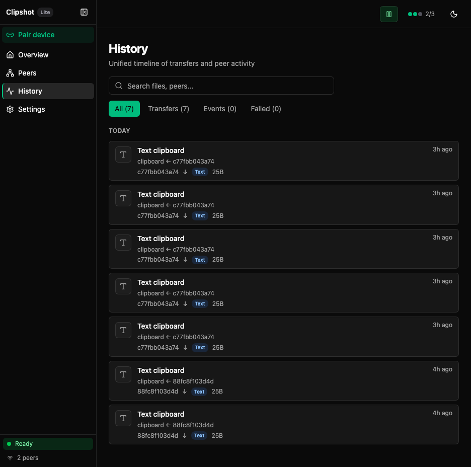

# Clipshot

**P2P mesh clipboard sync across all your devices.** Copy on one — paste on another.

[Download](https://clipshot.cc/#download){: .btn .btn-green }
[User Guide](user-guide){: .btn }
[GitHub](https://github.com/axelbaumlisto/clipshot){: .btn }

---

## Quick Start

```bash
curl -fsSL https://clipshot.cc/install.sh | bash -s -- --code=WORD-WORD-00
```

**Pair two devices:**
1. On device A: open GUI → Pair Device → Generate Code
2. On device B: enter the code
3. Done — clipboards sync automatically

## Features

- **Automatic clipboard sync** — text, images, files
- **P2P mesh** — direct QUIC connections, no cloud
- **GUI + CLI** — desktop app or headless daemon
- **Hub discovery** — devices find each other automatically
- **Pair codes** — zero-config pairing
- **Catch-up sync** — missed syncs delivered on reconnect
- **Cross-platform** — macOS, Linux, Windows

## Pricing

| | Lite (Free) | Pro ($5/mo) |
|:--|:--:|:--:|
| Devices | 2 | Unlimited |
| Local sync | ✅ | ✅ |
| Relay transport | — | ✅ |
| History | ✅ | ✅ |
| Auto-update | ✅ | ✅ |

**Lifetime Pro: $200**

## Documentation

| Document | Description |
|:---------|:------------|
| [User Guide](user-guide) | Installation, every screen, every button — with annotated screenshots |
| [E2E Testing](e2e-testing) | Docker E2E, stress tests, Playwright suites |
| [Release Checklist](release-checklist) | Build, sign, deploy, verify procedure |

## Usage

```bash
# Desktop (auto-launches GUI)
clipshot

# Headless daemon
clipshot daemon --port 19231 --http-port 18080

# CLI commands
clipshot pair WORD-WORD-00      # Pair with another device
clipshot share-uri              # Generate share link
clipshot push "hello"           # Send text to peers
clipshot history                # Show sync history
```

## Screenshots





