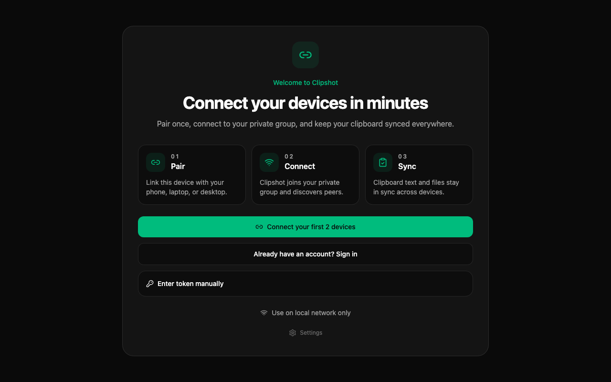
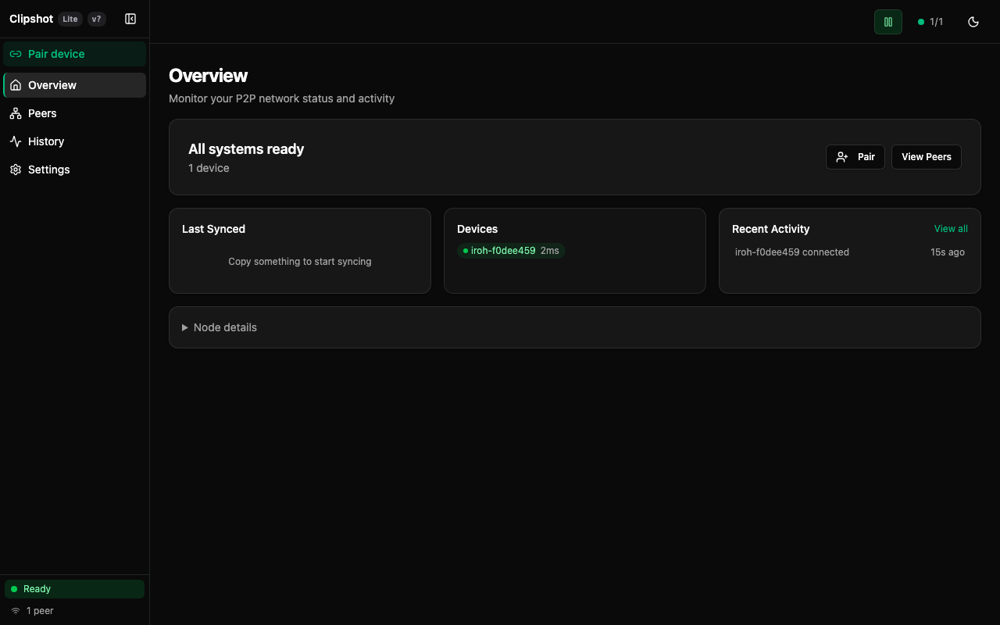
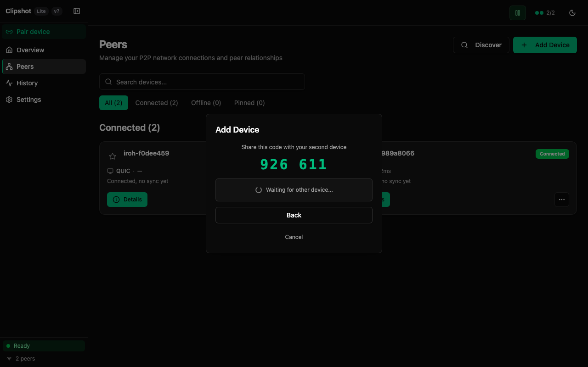
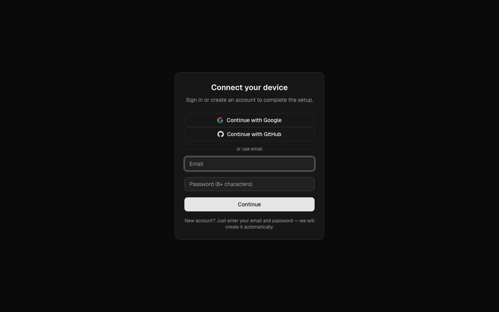
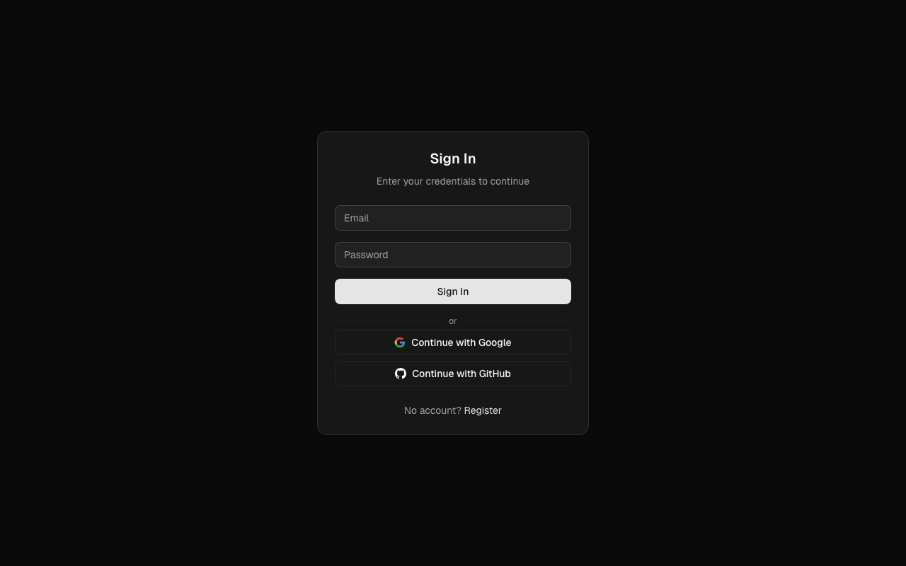

Use the one-line installer if you want the fastest setup. Use the binary or source build paths if you prefer to control the install manually.

## Install Clipshot

### One-liner (recommended)

**With pair code (works with or without account):**

```bash
curl -fsSL https://clipshot.cc/install.sh | bash -s -- --code=482917
```

Get the code from another device: `clipshot pair` or GUI → Pair device → Generate code.

**Without pair code (share link):**

```bash
curl -fsSL https://clipshot.cc/install.sh | bash -s -- --uri='clipshot://node/...'
```

**Install only (connect later):**

```bash
curl -fsSL https://clipshot.cc/install.sh | bash -s -- --headless --no-autostart
clipshot pair 482917        # join using 6-digit code from another device
clipshot pair               # or generate a new code on this device
clipshot setup              # create account in browser (optional)
```

What the installer does:
1. downloads the correct binary for your OS and CPU
2. installs it to `~/.local/bin` and adds it to your PATH
3. pre-configures `~/.config/clipshot/settings.toml` with the hub and relay URLs
4. authenticates — opens browser for device auth **or** pairs with `--code`
5. installs a background service with auto-start on boot (systemd on Linux, launchd on macOS)
6. starts the daemon and verifies the connection
7. enables PID lock — only one daemon instance can run at a time

Installer options:
- `--code=CODE` — 6-digit pair code from another device (e.g. `482917`)
- `--uri=URI` — share link from another device (no account needed)
- `--port=PORT` — daemon port (default 19231)
- `--hub=URL` — hub URL (default https://clipshot.cc)
- `--dist=URL` — override download base URL
- `--headless` — bare binary only (no DMG/GUI)
- `--no-autostart` — skip service creation

Supported platforms:
- Linux
- macOS

For Windows, use the binary download method below.

If you download the binary manually or build from source, pairing and service setup are not automatic. Run `clipshot setup` to create an account or `clipshot pair 482917` to join an existing group, then `clipshot service install` to set up auto-start.

### Auto-start behavior

By default, Clipshot starts automatically on boot:

| Install method | Linux | macOS | Windows |
|---|---|---|---|
| **One-liner** (`curl \| bash`) | systemd user service + linger | launchd agent (RunAtLoad + KeepAlive) | — |
| **GUI app** | `.desktop` in `~/.config/autostart/` | Login Items (via System Events) | — |
| **Manual binary** | run `clipshot service install` | run `clipshot service install` | manual |

To skip auto-start during install:

```bash
curl -fsSL https://clipshot.cc/install.sh | bash -s -- --no-autostart
```

To toggle auto-start from the GUI, go to **Settings → General → Start at login**.

**PID lock**: only one daemon can run at a time. If you try to start a second instance, it will exit with "Another clipshot daemon is already running".

### Download binary

Download the binary that matches your machine:

- `clipshot-linux-x64`
- `clipshot-macos-x64`
- `clipshot-macos-arm64`
- `clipshot-windows-x64.exe`

What happens next:
- On a desktop system with a display, running `clipshot` opens the GUI.
- On a headless machine, run `clipshot daemon` to start the background sync service.

### Build from source

If you prefer to build Clipshot yourself:

```bash
git clone <repo>
cd clipshot
cd web && bun install && bun run build && cd ..
cargo build --release
```

Headless build (no GUI):

```bash
cargo build --release --no-default-features --features iroh
```

### System requirements

| Platform | Clipboard tool | Notes |
|---|---|---|
| Linux X11 | `xclip` | Required for clipboard access |
| Linux Wayland | `wl-clipboard` | Required for clipboard access |
| Linux Wayland hotkey | XWayland recommended | Global hotkey support is limited on pure Wayland |
| macOS | `pngpaste` recommended | Strongly recommended for images |
| Windows | none | Built-in clipboard support |

Notes:
- On macOS, `pngpaste` is highly recommended. Without it, copied images can become huge raw TIFF files and may fail to sync.
- On Linux, if clipboard tools are missing, file sync may still work but live clipboard sync will not.

### macOS permissions

The desktop GUI requires two macOS privacy permissions for hotkeys to work:

| Permission | Why | Where to grant |
|---|---|---|
| **Input Monitoring** | Global hotkey listener (Cmd+Shift+S, Cmd+B) | System Settings → Privacy & Security → Input Monitoring |
| **Accessibility** | Simulates Cmd+V paste after Cmd+B | System Settings → Privacy & Security → Accessibility |

When either permission is missing, an amber banner appears at the top of the app with an **Open Settings** shortcut and a **Restart** button. Grant both permissions and restart Clipshot.

Headless daemon mode (`clipshot daemon ...`) does not require these permissions.

## First launch

If Clipshot has no group token yet, it opens the **Welcome Screen** instead of the full dashboard.

### Welcome Screen



The Welcome Screen shows:
- a short 3-step intro: **Pair → Connect → Sync**
- a primary button: **Connect your first 2 devices** — opens the Pair dialog
- a secondary link: **Already have an account? Sign in** — navigates to Settings to enter credentials
- a collapsible section: **Enter token manually**
- a link: **Use on local network only** — skips account setup, enables local-only mode with mDNS discovery
- a link: **Settings**


The image above shows the Welcome Screen with the **Add Device** dialog open. The dialog has two buttons: **Generate code** and **Enter code**.

This screen is for joining an existing Clipshot group or creating a new account.

### Pairing your first device

**Step 1 — Open the Pair dialog**

Click **Connect your first 2 devices** on the Welcome Screen (or **Pair device** in the sidebar if already set up). The Pair dialog opens.


The dialog has two buttons:
- **Generate code** — creates a 6-digit code on this device, valid for **5 minutes**.
- **Enter code** — type the 6-digit code from another device.

**Step 2 — Generate a code**

On one device, click **Generate code**. The dialog shows the code and waits.


**Step 3 — Enter the code on the second device**

On the second device, click **Enter code**, type the 6 digits, and click **Join**.

**Step 4 — Compare confirmation digits**

Both devices show 4 confirmation digits derived from a Diffie-Hellman key exchange.

- Digits match → click **Yes, they match** on both devices. ✓
- Digits differ → click **No** and start the pair flow again.

**Step 5 — Connected**

After confirmation, both devices are connected and clipboard sync starts automatically.



**Adding more devices:** click **Pair device** in the sidebar on any connected device and repeat steps 2–4. The Peers page shows all connected devices.



### Connecting via Portal account (optional)

A Portal account is not required, but it lets your devices auto-discover each other without sharing pair codes after the first setup.

1. Run `clipshot setup` in a terminal, or click **Already have an account? Sign in** on the Welcome Screen.
2. Your browser opens the Portal setup page.

   

3. Sign in with Google, GitHub, or email.

   

4. Your device is linked to your Portal group. Other devices in the same group reconnect automatically.

### Alternative: enter token manually

If you already have a group token:

1. Expand **Enter token manually**.
2. Paste your token, usually starting with `clip_`.
3. Click **Save token**.
4. Clipshot restarts and opens the normal app.

### Multiple groups

If your account has more than one group, the setup page will show a group picker — choose which group the new device should join. If you have only one group, it is selected automatically.
