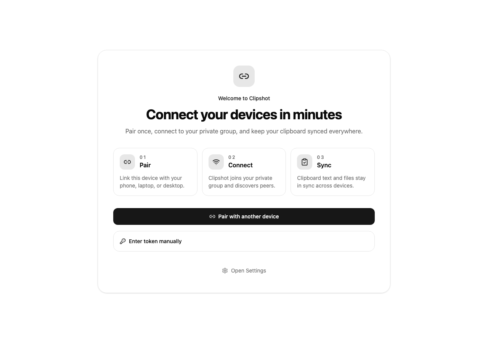
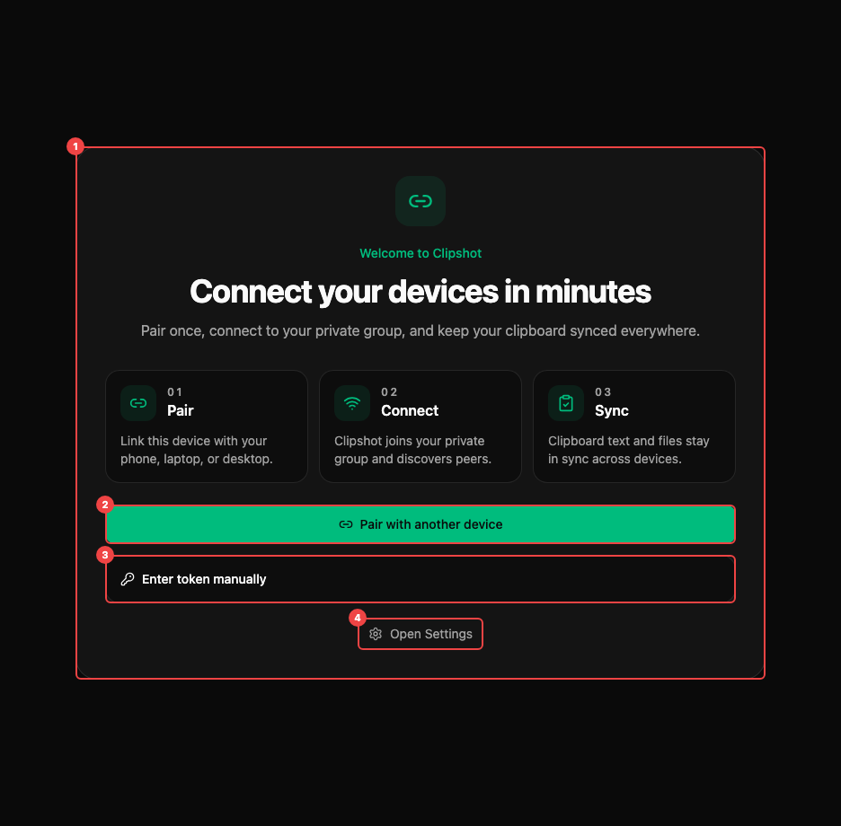

Use the one-line installer if you want the fastest setup. Use the binary or source build paths if you prefer to control the install manually.

## Install Clipshot

### One-liner (recommended)

The fastest way to add a new Linux or macOS device is:

```bash
curl -fsSL https://clipshot.cc/install.sh | bash
```

Without a `--code` flag the installer opens your browser to create an account or sign in — no pair code needed. After you finish in the browser, the installer saves your token and starts the daemon automatically.

To join an existing device's group instead:

```bash
curl -fsSL https://clipshot.cc/install.sh | bash -s -- --code=WORD-WORD-00
```

What the installer does:
1. downloads the correct binary for your OS and CPU
2. installs it to `~/.local/bin` and adds it to your PATH
3. pre-configures `~/.config/clipshot/settings.toml` with the hub and relay URLs
4. authenticates — opens browser for device auth **or** pairs with `--code`
5. installs a background service (systemd user service on Linux, launchd agent on macOS)
6. starts the daemon and verifies the connection

Other installer options: `--port=PORT`, `--hub=URL`.

Supported platforms:
- Linux
- macOS

For Windows, use the binary download method below.

If you download the binary manually or build from source, pairing and service setup are not automatic. Run `clipshot setup` to create an account or `clipshot pair WORD-WORD-00` to join an existing group, then `clipshot service install` to set up auto-start.

### Download binary

Download the binary that matches your machine:

- `clipshot-linux-x64`
- `clipshot-macos-x64`
- `clipshot-macos-arm64`
- `clipshot-windows-x64.exe`

What happens next:
- On a desktop system with a display, running `clipshot` opens the GUI.
- On a headless machine, run `clipshot daemon` to start the background sync service.

### Build from source

If you prefer to build Clipshot yourself:

```bash
git clone <repo>
cd clipshot
cd web && bun install && bun run build && cd ..
cargo build --release
```

Headless build (no GUI):

```bash
cargo build --release --no-default-features --features iroh
```

### System requirements

| Platform | Clipboard tool | Notes |
|---|---|---|
| Linux X11 | `xclip` | Required for clipboard access |
| Linux Wayland | `wl-clipboard` | Required for clipboard access |
| Linux Wayland hotkey | XWayland recommended | Global hotkey support is limited on pure Wayland |
| macOS | `pngpaste` recommended | Strongly recommended for images |
| Windows | none | Built-in clipboard support |

Notes:
- On macOS, `pngpaste` is highly recommended. Without it, copied images can become huge raw TIFF files and may fail to sync.
- On Linux, if clipboard tools are missing, file sync may still work but live clipboard sync will not.

## First launch

If Clipshot has no group token yet, it opens the **Welcome Screen** instead of the full dashboard.

### Welcome Screen



The Welcome Screen shows:
- a short 3-step intro: **Pair → Connect → Sync**
- a primary button: **Pair with another device**
- a secondary button: **Create Account** — opens your browser for registration (Google OAuth supported)
- a collapsible section: **Enter token manually**
- a link: **Open Settings**



The callouts above show: ① The intro card with the 3-step overview. ② **Pair with another device** — the recommended way to join an existing group. ③ **Create Account** — opens a browser-based registration flow. ④ **Enter token manually** — expand to paste an existing group token. ⑤ **Open Settings** — access settings before connecting.

This screen is for joining an existing Clipshot group or creating a new account.

### Pairing your first device

Recommended flow:

1. On an already connected device, open **Pair device** from the sidebar or **Add Device** from the Peers page.
2. Go to **Pair Code** and click **Generate Code**.
3. Clipshot shows a code like `WORD-WORD-00`.
4. On the new device, open Clipshot and click **Pair with another device**.
5. Enter the code and click **Join**.
6. Clipshot shows **Paired!** and restarts.
7. After restart, the main app opens with the full dashboard.

About the generated code:
- it is valid for **5 minutes**
- the dialog also lets you copy:
  - `clipshot pair WORD-WORD-00`

### Alternative: enter token manually

If you already have a group token:

1. Expand **Enter token manually**.
2. Paste your token, usually starting with `clip_`.
3. Click **Save token**.
4. Clipshot restarts and opens the normal app.

### Multiple groups

If your account has more than one group, the setup page will show a group picker — choose which group the new device should join. If you have only one group, it is selected automatically.
